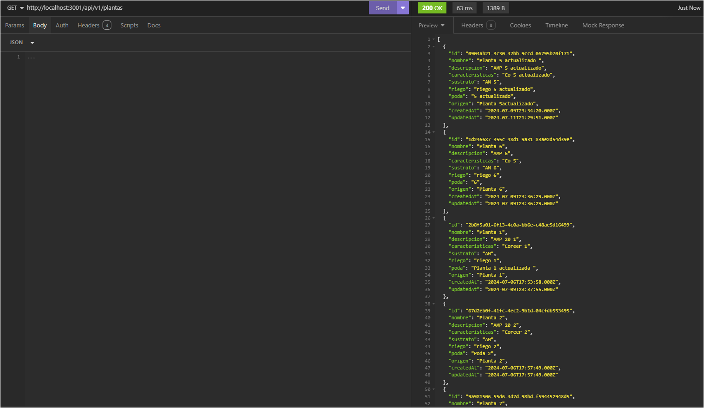
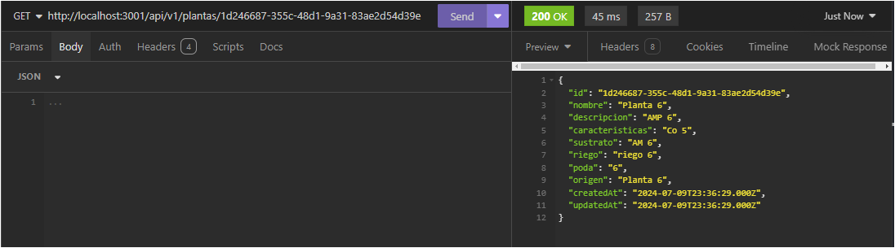
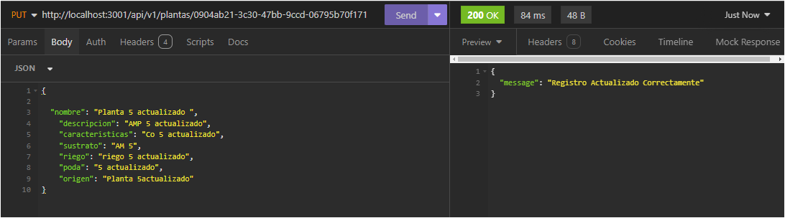
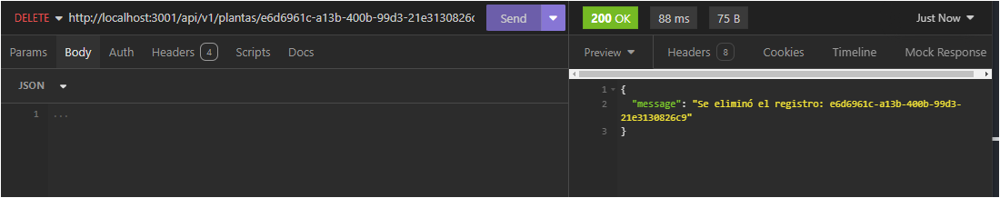

<h1 align="center"> Proyecto Codo a Codo - NodeJS </h1>

---

# API REST de Plantas

Esta es una API REST para gestionar información sobre plantas. La API permite crear, leer, actualizar y eliminar registros de plantas.

---

## Descripción General

La API REST de Plantas proporciona los siguientes endpoints:

- `GET /plantas` - Obtiene una lista de todas las plantas.
- `GET /plantas/{id}` - Obtiene los detalles de una planta específica por ID.
- `POST /plantas` - Crea una nueva planta.
- `PUT /plantas/{id}` - Actualiza una planta existente por ID.
- `DELETE /plantas/{id}` - Elimina una planta por ID.

---

## Requisitos

- Node.js
- Express
- Sequelize
- Base de datos (MySQL)
- Joi (Validaciones)
- Nodemon

---

## Instalación

1. Clone el repositorio:

   ```sh
   git clone https://github.com/Domegal13/plantas-api.git
   ```

2. Navega al directorio del proyecto:

   `cd repositorio-plantas`

3. Instala las dependencias:

   `npm install`

4. Configure la base de datos en el archivo .env.

```JavaScript
const mysql = {
  PORT: process.env.PORT,
  host: process.env.DB_HOST,
  user: process.env.DB_USER,
  password: process.env.DB_PASSWORD,
  database: process.env.DB_NAME,
  DB_PORT: process.env.DB_PORT,
};
```

---

## Uso

1. Inicie el servidor
   `npm run dev`

2. Para realizar las pruebas puede utilizar cualquier herramienta como:

- Insomnia.
- Postman.
- Thunder Client.
- etc.

---

## Endpoints

### 1. Obtener todas las plantas

- #### URL: `/api/v1/plantas`
- #### Método: `GET`



### 2. Obtener una planta por ID

- #### URL: `/api/v1/plantas/{id}`
- #### Método: `GET`



### 3. Crear una nueva Planta

- #### URL: `/api/v1/plantas/`
- #### Método: `POST`


### 2. Actualizar planta por ID

- #### URL: `/api/v1/plantas/{id}`
- #### Método: `PUT`



### 2. Eliminar una planta por ID

- #### URL: `/api/v1/plantas/{id}`
- #### Método: `GET`



---

## Autores ✒️

- Domenico Gallo [](https://github.com/Domegal13) [](https://www.linkedin.com/in/domegal13/)

- Guadalupe Luján Salgado [](https://github.com/guadasalgado) [](https://www.linkedin.com/in/guadasalgado/)

- MarinaCorbalan [](https://github.com/MarinaCorbalan) []()

- Agustin Peréz [](https://github.com/agus0914) []()

---
